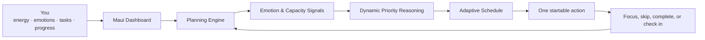
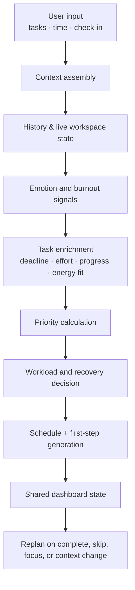
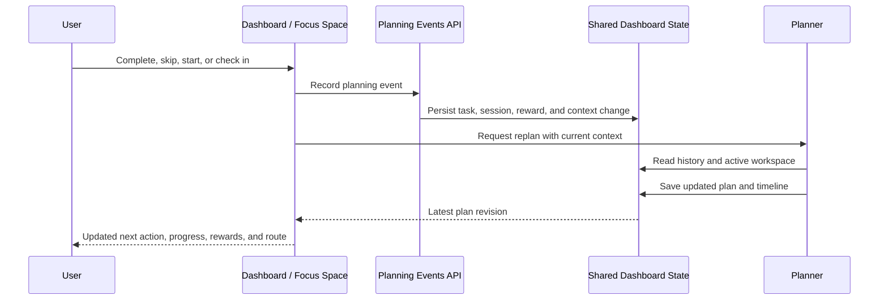
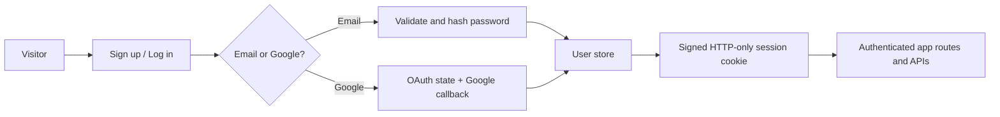
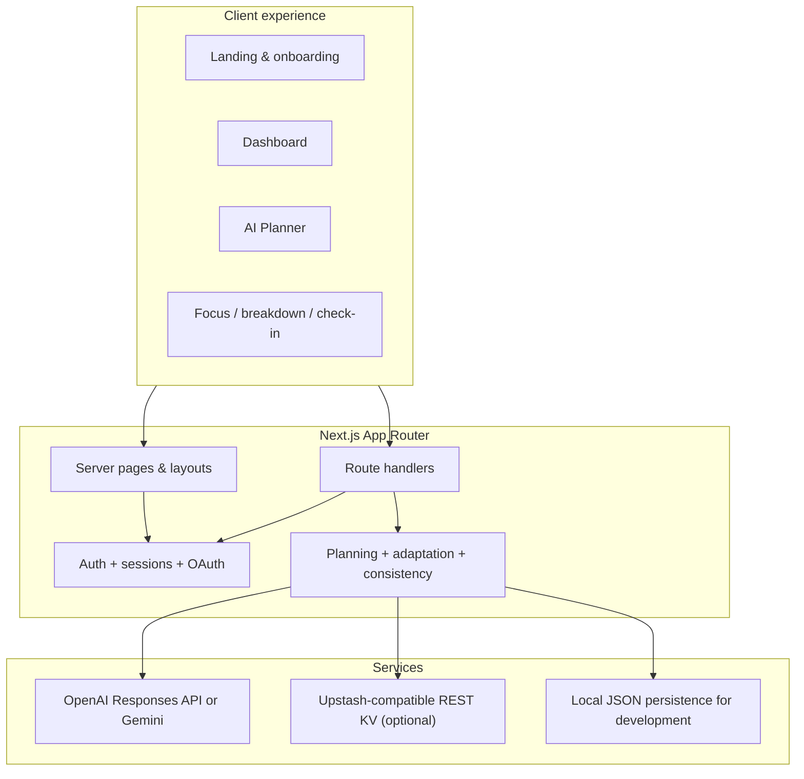

# Maui 🌊

<p align="center">
  <strong>An AI Productivity Operating System built for people with ADHD, executive dysfunction, and burnout.</strong>
</p>

<p align="center">
  Maui turns <em>“I know what I need to do”</em> into one calm, possible next move.
</p>

<p align="center">
  <a href="#getting-started">Get started</a> ·
  <a href="#how-maui-thinks">How it works</a> ·
  <a href="#architecture">Architecture</a> ·
  <a href="#roadmap">Roadmap</a> ·
  <a href="#contributing">Contribute</a>
</p>

<p align="center">
  
  
  
  
  
</p>

> [!IMPORTANT]
> Maui is not a clinical tool, diagnosis, or substitute for professional support. It is a compassionate productivity companion designed to lower daily friction.

---

## The invisible problem Maui was built to solve

Most productivity software begins with an assumption: if people are not getting things done, they need a better list, a stricter calendar, or more discipline.

That assumption misses the hardest part.

For many people—especially people navigating ADHD, executive dysfunction, anxiety, perfectionism, depression, chronic stress, or burnout—the gap is not knowledge. They often know exactly what needs doing. The gap is **activation**: turning intention into the first action while the brain is carrying uncertainty, emotional weight, limited energy, and too many competing decisions.

Traditional task managers are excellent at storing tasks. They are much less useful at answering the question that matters at 2:17 PM on a difficult Tuesday:

> *Given my actual energy, emotions, deadlines, history, and available time—what is the smallest useful thing to do now?*

Static to-do lists flatten everything into the same format. A five-minute email sits beside an emotionally loaded project. A missed task becomes visual evidence of failure. A packed calendar treats fatigue as a scheduling mistake. Overplanning becomes another source of decision fatigue, context switching, and productivity guilt.

Maui takes a different view: **the task is only half of the system. Human capacity is the other half.**

It does not ask people to adapt perfectly to a plan. It helps the plan adapt to the person.

---

## Meet Maui: an AI Productivity Operating System

Maui is deliberately not another to-do list, calendar, timer, or auto-scheduler. It is a living decision layer for the day.

Maui continuously brings together the signals that conventional planning tools ignore:

| Maui understands | So it can decide |
| --- | --- |
| Current energy and emotion | Whether today calls for deep work, a shorter block, recovery, or Survival Mode |
| Deadlines, urgency, and effort | What genuinely deserves attention now |
| Progress, missed work, and completed work | Whether to continue, defer, return later, or change approach |
| Cognitive and emotional load | How much work is realistic without creating a debt of exhaustion |
| Task avoidance and task size | When to create a gentler entry point instead of repeating “just start” |
| Available time and recent behaviour | What can fit today—and what should be explicitly protected for later |

The result is a calmer loop: Maui reads context, makes a trade-off, names the next action, and rethinks the day when reality changes.



---

## Why conventional productivity systems break down

### They manage inventory, not attention

Most applications help users capture tasks and assign dates. They do not distinguish a task that is technically small from one that is emotionally difficult, cognitively expensive, ambiguous, or repeatedly avoided. Maui considers difficulty, urgency, energy fit, task history, and available capacity before suggesting an action.

### They turn uncertainty into more choices

When someone is already overwhelmed, a board with twenty cards, ten filters, and an empty calendar does not create clarity. It creates another planning job. Maui narrows the field to a deliberate recommendation and explains the trade-off without making the user defend their limits.

### They confuse a missed plan with a failed person

Life interrupts. Focus can vanish. A deadline can move. A user can wake up tired or reach the afternoon already overloaded. A static schedule treats these changes as deviations; Maui treats them as new input. Skipping a task is not deletion—it is evidence the next plan should be different.

### They reward intensity instead of sustainability

Overplanning creates fragile plans and burnout cycles: push hard, fall behind, feel guilty, abandon the system. Maui protects recovery, leaves capacity intentionally unclaimed, and can simplify the day before it becomes unmanageable.

---

## Core capabilities

### 🌊 Adaptive Task Planning

Maui builds a plan for the moment—not a rigid timeline that the user must obey. It weighs available minutes, deadlines, task difficulty, unfinished progress, energy, emotion, and burnout risk to select a realistic route through the day. When a task is completed, skipped, paused, or newly added, the planning system can reassess the shared plan.

The planner makes its trade-offs visible: why a task is early, why a block is capped, what was postponed, and when to reassess. This turns “AI scheduling” from a black box into calm, inspectable reasoning.

### 🧠 Executive Dysfunction Support

Large labels such as “Study Statistics” can hide dozens of decisions. Maui lowers the activation barrier by attaching a concrete first step to every planned task: a small action that can be done in under two minutes and is tailored to the task and current capacity.

When a task still feels impossible, the Task Breakdown flow converts it into progressively smaller micro-steps. The goal is not to force motivation; it is to remove enough friction for motion to become possible.

### 💬 Emotion-Aware AI

Users can check in with Maui in their own words. The emotion flow interprets signals such as stress, tiredness, hopefulness, or overwhelm and returns supportive guidance alongside a workload adjustment. Emotional context is not a decorative mood tracker—it changes planning decisions.

High overload can shorten focus blocks, introduce a transition, reserve recovery, reduce the number of tasks, or activate a gentler route. Maui supports without shaming and avoids pretending to diagnose a user.

### ⚡ Smart Energy Scheduling

The same task is not equally suitable at every hour. Maui uses self-reported energy, emotional state, survey preferences, task difficulty, and workload risk to decide whether the next block should be light, balanced, or deep.

The system deliberately keeps blocks bounded and pairs demand with recovery where appropriate. It is designed around sustainable cognitive load, not the fantasy that every empty hour is equally productive.

### 🎯 Dynamic Priority Engine

Priority is a moving decision, not a permanent tag. Maui considers urgency, deadline proximity, difficulty, focus time, progress already made, present energy, and planning memory. It can prioritize a near deadline, preserve momentum on work already started, or intentionally defer a lower-impact task when capacity is limited.

This makes “what matters now?” a living answer rather than a manually maintained sort order.

### 🌱 Burnout Prevention

Maui treats recovery as part of the plan. When capacity signals are low or burnout risk rises, it reduces task count, shortens blocks, protects recovery time, and makes postponement explicit. The aim is to prevent a difficult day from becoming a full-system collapse.

> [!TIP]
> A smaller plan that can be started is more valuable than an ambitious plan that produces guilt.

### 📈 Progress Insights

Maui tracks meaningful movement: focus sessions, completed micro-steps, points, activity days, and consistency patterns. The system is built to reward showing up and returning—not only perfect streaks or large outcomes.

### 🤝 Gentle Accountability

Accountability should sound like support, not surveillance. Maui remembers recent moments, keeps the next action visible, and invites a user to check in, make a task smaller, skip for now, or finish a block. The language is intentionally non-punitive: a difficult session is information for the next decision.

### 📝 AI Task Breakdown

The breakdown workflow takes a broad or intimidating task and produces a practical, startable roadmap. It is especially useful when a task contains hidden ambiguity, perfectionism, or avoidance. Micro-steps can be completed individually, creating visible momentum before the larger task is done.

### 🐠 Survival Mode

Some days need a different operating mode. Survival Mode preserves the original task set, switches context to high burnout risk, and adapts active tasks to the smallest useful path. It offers a deliberate exit from all-or-nothing planning: protect the day first, restore the full route when capacity returns.

---

## Product philosophy

| We choose | Over |
| --- | --- |
| **Progress over perfection** | Waiting for the ideal plan, mood, or output |
| **Adaptation over discipline** | Treating human variability as a personal failure |
| **Sustainability over hustle** | Filling every available minute |
| **Compassion over pressure** | Guilt, streak anxiety, and punitive reminders |
| **Understanding over task volume** | Measuring a day only by how much was checked off |
| **One possible next move** | A wall of competing decisions |

Maui is based on a simple belief: productivity becomes kinder and more reliable when systems are designed for the way people actually experience a day.

---

## How Maui thinks

### The planning pipeline



1. **Listen** — Maui receives tasks, available time, survey preferences, an optional emotional check-in, and the current clock.
2. **Remember** — It reads persisted workspace state, recent moments, reward events, completed work, active sessions, and planning memory.
3. **Assess capacity** — Emotion, energy, interruption signals, and burnout risk determine the shape of a realistic day.
4. **Rank intelligently** — The engine scores urgency, priority, deadline proximity, difficulty, progress momentum, and energy fit.
5. **Make trade-offs** — It selects a small number of tasks, creates focused blocks, schedules recovery when warranted, and explicitly postpones work that does not fit.
6. **Reduce activation energy** — Each task block gets a concrete, task-specific first step.
7. **Synchronize and adapt** — Focus events and context changes update shared state, allowing the dashboard and planner to converge on the latest decision.

### A shared dashboard, not isolated widgets

Maui’s dashboard state is the product’s common language. Planning, focus sessions, rewards, emotional context, active task status, task checklists, and recent moments are persisted together. API events update that state; replanning then reflects the new reality across the dashboard.



### Authentication flow

Maui supports email/password authentication and optional Google OAuth. Authenticated route handlers resolve the user from an HTTP-only session cookie before accessing planning or dashboard state.



---

## Architecture

Maui is a full-stack Next.js application using the App Router. Server-rendered pages establish authenticated context; focused client components power interactive spaces such as the planner, dashboard, focus timer, and check-in flows. Route handlers provide an intentionally narrow API boundary around AI generation, authentication, planning events, dashboard adaptation, rewards, and profile data.



### Data and synchronization choices

- **Planning engine** — assembles context, selects work, creates schedule blocks, produces first steps, and persists a revisioned plan.
- **Decision engine** — derives the current next action and an explicit adaptation status (`on_track`, `adjusting`, or `protecting`) from live state.
- **Synchronization layer** — records focus and task events, maintains planning memory, calculates consistency, updates rewards, and merges checklist state.
- **Storage layer** — uses a REST KV store when configured; otherwise writes development data to `.local-data/`. The latter should not be used as a production database.
- **AI provider layer** — centralizes structured JSON generation and supports OpenAI by default or Gemini via `AI_PROVIDER=gemini`.

---

## Technology stack

| Layer | Technology | Why it is here |
| --- | --- | --- |
| Framework | Next.js 16 (App Router) | One TypeScript codebase for server-rendered pages, client experiences, and route handlers |
| UI | React 19 | Composable, responsive interfaces for high-feedback productivity flows |
| Language | TypeScript 5 | Safer shared contracts between planning, dashboard, and API layers |
| Styling | Tailwind CSS 4 + CSS variables | A fast, expressive design system with theme-friendly primitives |
| Motion | Framer Motion | Gentle state transitions and feedback without turning the product into visual noise |
| Icons | Lucide React | Clear, consistent, accessible iconography |
| AI | OpenAI Responses API or Google Gemini | Structured outputs for plans, burnout check-ins, and task breakdowns |
| Authentication | Signed cookie sessions + Google OAuth | Server-side session resolution with optional social sign-in |
| Persistence | REST KV / local JSON fallback | Simple deployment path plus a low-friction local development experience |
| API architecture | Next.js Route Handlers | Cohesive, authenticated endpoints colocated with the application |
| Tooling | ESLint + TypeScript | Fast static feedback through `lint`, `typecheck`, and `check` scripts |
| Package manager | npm | Lockfile-backed, familiar project setup |

---

## Project structure

```text
maui/
├── app/                            # App Router pages, layouts, and HTTP route handlers
│   ├── api/
│   │   ├── ai/                     # Planner, task-breakdown, and burnout AI endpoints
│   │   ├── auth/                   # Email/password and Google OAuth endpoints
│   │   ├── dashboard/              # Workspace adaptation endpoint
│   │   ├── planning/               # Event recording and state synchronization
│   │   ├── profile/                # Onboarding and personalization persistence
│   │   └── rewards/                # Reward event endpoint
│   ├── dashboard/                  # Live accountability dashboard route
│   ├── planner/                    # Capacity-aware planner route
│   ├── focus-session/              # Focus space entry point
│   ├── emotions/                   # Emotion check-in route
│   ├── burnout/                    # Burnout-focused workspace
│   ├── survival-mode/              # Simplified low-capacity workspace
│   ├── onboarding/                 # User context collection
│   └── layout.tsx                  # Root layout and application shell
├── components/
│   ├── app/                        # Product workspaces: dashboard, planner, breakdown, survival
│   ├── layout/                     # Navigation and marketing-page sections
│   ├── onboarding/                 # Onboarding experience
│   ├── personalization/            # Task and study-profile inputs
│   └── ui/                         # Reusable cards, buttons, inputs, and modal primitives
├── lib/
│   ├── ai/                         # Provider abstraction, schemas, and AI contracts
│   ├── auth/                       # Crypto, sessions, OAuth, validation, and user store
│   ├── dashboard/                  # Workspace state and consistency calculations
│   ├── planning/                   # Decision engine and synchronization logic
│   ├── tasks/                      # Capacity adaptation and task scoring helpers
│   ├── rewards/                    # Reward persistence and summaries
│   └── storage/                    # KV abstraction
├── hooks/                          # Client-side task, session, and emotion hooks
├── store/                          # Client state utilities
├── types/                          # Shared TypeScript types
├── public/                         # Static assets
├── .local-data/                    # Local-only development persistence (gitignored)
├── package.json                    # Scripts and dependencies
└── next.config.ts                  # Next.js configuration
```

---

## Getting started

### Prerequisites

- Node.js 20.9 or later
- npm 10 or later
- An AI provider key: OpenAI **or** Google Gemini
- Optional: Google OAuth credentials for “Continue with Google”
- Optional: Upstash-compatible REST KV credentials for shared persistence

### 1. Clone and install

```bash
git clone https://github.com/<your-org>/maui.git
cd maui
npm install
```

### 2. Create your environment file

```bash
cp .env.example .env.local
```

Windows PowerShell:

```powershell
Copy-Item .env.example .env.local
```

If the repository does not yet include `.env.example`, create `.env.local` with the variables below. Never commit it.

### 3. Configure an AI provider

For OpenAI (the default provider):

```dotenv
OPENAI_API_KEY=your_key_here
OPENAI_MODEL=gpt-5
```

For Gemini:

```dotenv
AI_PROVIDER=gemini
GEMINI_API_KEY=your_key_here
GEMINI_MODEL=gemini-2.5-flash
```

### 4. Start the development server

```bash
npm run dev
```

Open [http://localhost:3000](http://localhost:3000). Create an account, complete onboarding, and let Maui generate the first capacity-aware plan.

### 5. Verify before shipping

```bash
npm run check
npm run build
npm run start
```

`npm run check` runs ESLint and TypeScript validation. `npm run build` produces the production Next.js build; `npm run start` serves that build.

---

## Environment variables

| Variable | Required | Purpose |
| --- | :---: | --- |
| `OPENAI_API_KEY` | For OpenAI | Server-only API key used by the OpenAI structured-output provider |
| `OPENAI_MODEL` | No | OpenAI model override; defaults to `gpt-5` |
| `AI_PROVIDER` | No | Set to `gemini` to use Google Gemini; OpenAI is used otherwise |
| `GEMINI_API_KEY` | For Gemini | Server-only Gemini API key |
| `GEMINI_MODEL` | No | Gemini model override; defaults to `gemini-2.5-flash` |
| `AUTH_SECRET` | **Yes in production** | High-entropy secret used to sign and verify sessions |
| `APP_URL` | **Yes in production** | Canonical public URL, used for OAuth redirects |
| `NEXT_PUBLIC_APP_URL` | No | Public fallback URL for client-safe app references and OAuth configuration |
| `GOOGLE_CLIENT_ID` | For Google sign-in | OAuth client ID from Google Cloud |
| `GOOGLE_CLIENT_SECRET` | For Google sign-in | OAuth client secret from Google Cloud |
| `KV_REST_API_URL` | No | Upstash-compatible REST KV endpoint |
| `KV_REST_API_TOKEN` | No | Token used to read and write application state in KV |
| `UPSTASH_REDIS_REST_URL` | No | Alternative accepted name for the KV REST endpoint |
| `UPSTASH_REDIS_REST_TOKEN` | No | Alternative accepted name for the KV REST token |

> [!WARNING]
> Keep secrets server-only. Do not prefix secrets with `NEXT_PUBLIC_`, do not put them in browser code, and rotate them if they are exposed. Production authentication requires `AUTH_SECRET`; local development has a development-only fallback.

### Local persistence versus KV

Without KV configuration, Maui stores development state under `.local-data/`. This is convenient for local exploration but is not suitable for multi-instance production deployments. Configure a KV service before deploying a shared application.

---

## Screenshots

Product screenshots will live in `public/screenshots/`. The following placeholders keep the README ready for an asset drop without pretending that mockups are real product captures.

| Experience | Placeholder |
| --- | --- |
| Landing page | `public/screenshots/landing-page.png` |
| Dashboard | `public/screenshots/dashboard.png` |
| AI Planner | `public/screenshots/planner.png` |
| Focus Space | `public/screenshots/focus-space.png` |
| Onboarding | `public/screenshots/onboarding.png` |
| Emotion Check-In | `public/screenshots/emotion-check-in.png` |
| Task Breakdown | `public/screenshots/task-breakdown.png` |
| Survival Mode | `public/screenshots/survival-mode.png` |

When assets are added, use descriptive alt text and keep images optimized. Example:

```md

```

---

## Accessibility

Maui’s purpose makes accessibility non-negotiable. A productivity system cannot claim to reduce friction while adding interaction barriers.

- Semantic HTML and labelled controls are used as the baseline, not an afterthought.
- Keyboard navigation and visible focus states should work across every workspace and modal.
- Interactive flows should preserve a logical tab order and never rely on colour alone to convey status.
- Motion should be purposeful, subtle, and respectful of `prefers-reduced-motion` preferences as the interface evolves.
- Copy should be direct, non-shaming, and easy to understand under cognitive load.
- Icons should have accessible names when they represent actions; decorative icons should be hidden from assistive technology.

Accessibility is an ongoing product practice. Please report barriers in an issue with steps to reproduce and the assistive technology or browser involved.

---

## Performance

Maui uses several techniques to keep an emotionally supportive interface responsive:

- Server Components render page-level authenticated context close to the data source.
- Interactive dashboard flows are client components only where state, timers, effects, or browser APIs are necessary.
- Secondary modal experiences are dynamically imported, reducing the initial dashboard bundle.
- Route handlers separate server-only AI keys and persistence operations from the client bundle.
- The planning and dashboard layers exchange concise, typed state rather than rebuilding unrelated UI state on every interaction.
- The storage abstraction supports remote KV persistence while retaining a fast local-development fallback.

Before merging performance-sensitive changes, measure the actual route, preserve dynamic import boundaries, and avoid pulling server-only code into client components.

---

## Security and privacy

Maui handles personal productivity and emotional context with care.

- Authentication uses signed session tokens stored in HTTP-only, `SameSite=Lax` cookies. Cookies are marked `Secure` in production.
- Authenticated API routes resolve the user server-side before reading or mutating workspace data.
- Passwords are validated and verified through the auth layer; OAuth requests use state protection and a server-side callback flow.
- AI provider keys, OAuth secrets, session secrets, and KV tokens remain server environment variables.
- Google OAuth configuration uses a canonical production URL to keep redirect handling predictable.
- Current storage is intentionally simple. Teams deploying Maui should use a production-grade, encrypted persistence strategy, define retention policies, and review provider data-processing terms before handling sensitive data at scale.

Do not include emotional check-ins, API keys, access tokens, or user data in bug reports, commits, or screenshots.

---

## Roadmap

Maui is already designed around live context and adaptation. The following milestones deepen that promise.

### Intelligence and planning

- [x] Capacity-aware AI planning with explicit trade-offs
- [x] Emotion-aware check-ins and burnout-sensitive workload adjustment
- [x] Task-specific first steps and AI task breakdown
- [x] Shared dashboard planning state and event-driven replanning
- [x] Survival Mode for high-overwhelm days
- [ ] Long-term AI memory for preferred working hours, successful routines, and avoidance patterns
- [ ] Predictive burnout detection using longitudinal, user-controlled signals
- [ ] Richer calendar-aware planning and deadline ingestion
- [ ] Better estimation feedback loops from planned versus completed focus time

### Experiences

- [ ] Google Calendar and Outlook Calendar integration
- [ ] Wearable integration for opt-in energy and recovery signals
- [ ] Voice companion for low-friction check-ins and task capture
- [ ] Offline-first mode with background synchronization
- [ ] Native mobile apps
- [ ] Browser extension for turning tabs and web tasks into calm next actions
- [ ] Collaborative planning for partners, coaches, or care teams—with granular consent controls
- [ ] Smart, consent-based notifications that respect attention rather than demand it

### Platform and quality

- [ ] Production database migrations and multi-user observability
- [ ] End-to-end test coverage for planning and synchronization flows
- [ ] Accessibility audit and reduced-motion test suite
- [ ] Public component and API documentation

Roadmaps are directional, not promises. Maui will prioritize changes that most directly reduce friction and protect user capacity.

---

## Contributing

Contributions are welcome—especially from people with lived experience of the problems Maui is trying to solve. Product empathy is a technical requirement here.

### Before you start

1. Search existing issues and pull requests.
2. Open an issue for substantial design, architecture, or behavioural changes before investing in a large implementation.
3. Keep the user promise in view: a change should lower cognitive friction, preserve agency, or improve the reliability of the system.

### Development workflow

```bash
git checkout -b codex/short-descriptive-name
npm install
npm run check
```

Use the branch prefix `codex/` unless maintainers specify otherwise. Keep branches focused: one capability or coherent fix per pull request.

### Commit conventions

Use concise, imperative commit messages. Conventional Commit-style prefixes are encouraged:

```text
feat(planner): add first-step guidance to schedule blocks
fix(auth): preserve OAuth state on canonical redirect
docs(readme): clarify local persistence behaviour
refactor(planning): extract capacity scoring helper
```

### Pull request checklist

- [ ] The change is scoped and described clearly.
- [ ] `npm run check` passes.
- [ ] Relevant flows have been tested manually, including empty, loading, error, and low-capacity states.
- [ ] UI changes work with keyboard navigation and do not depend on colour alone.
- [ ] AI copy is specific, supportive, and non-shaming.
- [ ] No secrets, personal data, or `.local-data/` files are included.
- [ ] New configuration is documented in this README.

### Coding standards

- Prefer TypeScript types at every boundary—AI outputs, API payloads, state, and UI props.
- Preserve server/client boundaries: browser-only state belongs in client components; secrets and persistence belong on the server.
- Build from shared state rather than creating isolated dashboard widgets.
- Make planning decisions observable. If Maui changes the plan, the user should be able to understand why.
- Avoid generic motivational templates. Guidance should use real context or clearly acknowledge uncertainty.
- Keep language compassionate. Maui never turns a hard day into a moral failure.

---

## License

Maui is released under the [MIT License](LICENSE).

```text
MIT License

Copyright (c) 2026 Maui contributors

Permission is hereby granted, free of charge, to any person obtaining a copy
of this software and associated documentation files (the "Software"), to deal
in the Software without restriction, including without limitation the rights
to use, copy, modify, merge, publish, distribute, sublicense, and/or sell
copies of the Software, and to permit persons to whom the Software is
furnished to do so, subject to the following conditions:

The above copyright notice and this permission notice shall be included in all
copies or substantial portions of the Software.

THE SOFTWARE IS PROVIDED "AS IS", WITHOUT WARRANTY OF ANY KIND, EXPRESS OR
IMPLIED, INCLUDING BUT NOT LIMITED TO THE WARRANTIES OF MERCHANTABILITY,
FITNESS FOR A PARTICULAR PURPOSE AND NONINFRINGEMENT. IN NO EVENT SHALL THE
AUTHORS OR COPYRIGHT HOLDERS BE LIABLE FOR ANY CLAIM, DAMAGES OR OTHER
LIABILITY, WHETHER IN AN ACTION OF CONTRACT, TORT OR OTHERWISE, ARISING FROM,
OUT OF OR IN CONNECTION WITH THE SOFTWARE OR THE USE OR OTHER DEALINGS IN THE
SOFTWARE.
```

---

> **Productivity is not about doing more. It is about making it easier to begin.**
>
> Maui exists to remove the invisible friction between intention and action—so that every small step can feel possible.
